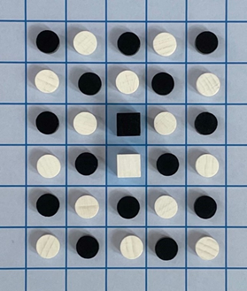
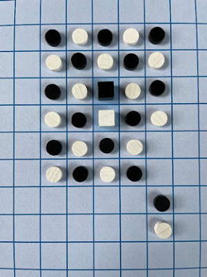
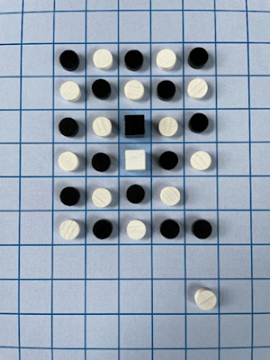

# Trabalho Prático #2 - Splinter Board Game

## Grupo Splinter_1

| Elementos                                                 | Percentagem |
| --------------------------------------------------------- | :---------: |
| Adriano Filipe Ribeiro Soares (<up201904873@up.pt>)       |     55%     |
| Vasco Marinho Rodrigues Gomes Alves (<up201808031@up.pt>) |     45%     |

## Instalação e Execução

O nosso projeto está dividido por quatro módulos distintos: `splinter`, `output`, `input` e `utils`. Todos estes têm as inclusões necessárias em cabeçalho de modo a executá-los individualmente, no entanto, é recomendável executar apenas o módulo `splinter` que incluí todos os módulos necessários para a execução do jogo. O jogo é inicializado através do predicado `play/0` presente no módulo `splinter`.

## Descrição do Jogo

- **<u>Componentes</u>**:
  - 2 Jogadores.
  - Tabuleiro 18x15.
  - 14 Peões Brancos, 14 Peões Pretos, 1 Rei Branco e 1 Rei Preto.
- <u>**Objetivo**</u>:
  - O objetivo do jogo é fazer *splinter* ao rei do oponente de modo que este fique num grupo mais pequeno do que o nosso.

- <u>**Como Jogar**</u>:
  - Organizar o tabuleiro de modo a que as peças estejam num único grupo, conectado, com os reis a ocupar os quadrados centrais do tabuleiro.

|                      |
| :----------------------------------------------: |
| *Figura 1: Estado do tabuleiro de jogo inicial.* |

  - Escolher um jogador para iniciar o jogo (peças brancas ou pretas) e depois continuar com turnos alternados.
  - No nosso turno, mover uma das nossas peças um quadrado em qualquer direção, incluindo diagonalmente, de modo a cair num quadrado adjacente. Qualquer peça que esteja no caminho é simplesmente puxada na mesma direção. Não há limite para o número de peças que se pode puxar.
  - Um *splinter* ocorre quando uma ou mais peças ficam desconectadas do grupo original, havendo quadrados vazios entre essas peças a o grupo. Após um *splinter*, todos os grupos que não tiverem um rei estão fora do jogo e os seus peões são removidos do tabuleiro.

|                                  |                                  |
| :----------------------------------------------------------: | :----------------------------------------------------------: |
| *Figura 2: Estado do tabuleiro do jogo sem ocorrência de splinter.* | *Figura 3: Estado do tabuleiro do jogo com ocorrência de splinter.* |

  - Se um *splinter* resultar nos reis a ocupar grupos diferentes, o jogo acaba e o jogador cujo rei estiver no maior grupo vence o jogo (peças de ambas as cores valem o mesmo). Se os dois grupos forem de tamanho igual, o jogador que tiver perdido menos peões ganha o jogo. Se ambos os jogadores tiverem perdido o mesmo número de peões, o jogo acaba empatado. Adicionalmente, se um *splinter* levar a que um jogador fique sem peões, o jogo acaba e o outro jogador vence.

  > <u>**Referências**</u>: [Splinter Board Game](https://splinterboardgame.blogspot.com/2021/06/splinter-is-two-player-abstractstrategy.html)

## Lógica do Jogo

- <u>**Início de Jogo**</u>:
  - O jogo é inicializado com o predicado `play/0`, que é responsável por apresentar o menu inicial e começar o `game_loop/3` de acordo com a opção de jogo escolhida. Existem quatro opções válidas, H/H, H/PC, PC/H e PC/PC. No caso de ser escolhido um modo de jogo que envolva o computador é pedido ao utilizador para escolher o seu nível de inteligência. Quer para a escolha do modo de jogo quer para a escolha do nível da IA é efetuada e verificação de input, pedindo ao utilizador para voltar a introduzir a sua opção caso este seja inválido (com a utilização do módulo `input` por nós criado).

- <u>**Representação Interna do Estado do Jogo**</u>:
  
  - Para representar o tabuleiro, é usada uma lista de listas, sendo os peões brancos e pretos representados por `wp`  e `bp` respetivamente. O rei branco é representado por `wk` e o rei preto por `bk`. Os espaços vazios são representados por `<>`.
  
  - <u>**Estados de Jogo**</u>:
    - <u>Estado Inicial</u>: O jogo começa com as peças organizadas num bloco central, ocupando posições alternadas e com os dois reis ao centro.
    
      ```prolog
          a    b    c    d    e    f    g    h    i    j    k    l    m    n    o
      
      0   <>   <>   <>   <>   <>   <>   <>   <>   <>   <>   <>   <>   <>   <>   <>   
      
      1   <>   <>   <>   <>   <>   <>   <>   <>   <>   <>   <>   <>   <>   <>   <>   
      
      2   <>   <>   <>   <>   <>   <>   <>   <>   <>   <>   <>   <>   <>   <>   <>   
      
      3   <>   <>   <>   <>   <>   <>   <>   <>   <>   <>   <>   <>   <>   <>   <>   
      
      4   <>   <>   <>   <>   <>   <>   <>   <>   <>   <>   <>   <>   <>   <>   <>   
      
      5   <>   <>   <>   <>   <>   <>   <>   <>   <>   <>   <>   <>   <>   <>   <>   
      
      6   <>   <>   <>   <>   <>   bp   wp   bp   wp   bp   <>   <>   <>   <>   <>   
      
      7   <>   <>   <>   <>   <>   wp   bp   wp   bp   wp   <>   <>   <>   <>   <>   
      
      8   <>   <>   <>   <>   <>   bp   wp   bk   wp   bp   <>   <>   <>   <>   <>   
      
      9   <>   <>   <>   <>   <>   wp   bp   wk   bp   wp   <>   <>   <>   <>   <>   
      
      10  <>   <>   <>   <>   <>   bp   wp   bp   wp   bp   <>   <>   <>   <>   <>   
      
      11  <>   <>   <>   <>   <>   wp   bp   wp   bp   wp   <>   <>   <>   <>   <>   
      
      12  <>   <>   <>   <>   <>   <>   <>   <>   <>   <>   <>   <>   <>   <>   <>   
      
      13  <>   <>   <>   <>   <>   <>   <>   <>   <>   <>   <>   <>   <>   <>   <>   
      
      14  <>   <>   <>   <>   <>   <>   <>   <>   <>   <>   <>   <>   <>   <>   <>   
      
      15  <>   <>   <>   <>   <>   <>   <>   <>   <>   <>   <>   <>   <>   <>   <>   
      
      16  <>   <>   <>   <>   <>   <>   <>   <>   <>   <>   <>   <>   <>   <>   <>   
      
      17  <>   <>   <>   <>   <>   <>   <>   <>   <>   <>   <>   <>   <>   <>   <>
      ```
    
    - <u>Estado Intermédio</u>: Os jogadores podem mover as suas peças em qualquer direção e até empurrar outras peças.
    
      ```prolog
          a    b    c    d    e    f    g    h    i    j    k    l    m    n    o
      
      0   <>   <>   <>   <>   <>   <>   <>   <>   <>   <>   <>   <>   <>   <>   <>   
      
      1   <>   <>   <>   <>   <>   <>   <>   <>   <>   <>   <>   <>   <>   <>   <>   
      
      2   <>   <>   <>   <>   <>   <>   <>   <>   <>   <>   <>   <>   <>   <>   <>   
      
      3   <>   <>   <>   <>   <>   <>   <>   <>   <>   <>   <>   <>   <>   <>   <>   
      
      4   <>   <>   <>   <>   <>   <>   <>   <>   <>   <>   <>   <>   <>   <>   <>   
      
      5   <>   <>   <>   <>   <>   <>   <>   <>   <>   <>   <>   <>   <>   <>   <>   
      
      6   <>   <>   <>   <>   wp   <>   <>   bk   bp   <>   <>   <>   <>   <>   <>   
      
      7   <>   <>   <>   <>   <>   bp   bp   <>   wp   <>   <>   <>   <>   <>   <>   
      
      8   <>   <>   <>   <>   <>   <>   bp   wp   wp   wp   <>   <>   <>   <>   <>   
      
      9   <>   <>   <>   <>   <>   <>   wp   wp   wp   wp   bp   <>   <>   <>   <>   
      
      10  <>   <>   <>   <>   <>   <>   wp   wp   wp   wk   bp   <>   <>   <>   <>   
      
      11  <>   <>   <>   <>   <>   <>   bp   wp   wp   <>   <>   bp   <>   <>   <>   
      
      12  <>   <>   <>   <>   <>   <>   <>   <>   bp   <>   <>   <>   <>   <>   <>   
      
      13  <>   <>   <>   <>   <>   <>   <>   <>   <>   <>   <>   <>   <>   <>   <>   
      
      14  <>   <>   <>   <>   <>   <>   <>   <>   <>   <>   <>   <>   <>   <>   <>   
      
      15  <>   <>   <>   <>   <>   <>   <>   <>   <>   <>   <>   <>   <>   <>   <>   
      
      16  <>   <>   <>   <>   <>   <>   <>   <>   <>   <>   <>   <>   <>   <>   <>   
      
      17  <>   <>   <>   <>   <>   <>   <>   <>   <>   <>   <>   <>   <>   <>   <>
      ```
    
    - <u>Estado Final</u>: O jogo acaba quando uma jogada resulta nos dois reis ficarem em grupos separados, ganhando o jogador cujo rei tem o maior grupo.
    
      ```prolog
          a    b    c    d    e    f    g    h    i    j    k    l    m    n    o
      
      0   <>   <>   <>   <>   <>   <>   <>   <>   <>   <>   <>   <>   <>   <>   <>   
      
      1   <>   <>   <>   <>   <>   <>   <>   <>   <>   <>   <>   <>   <>   <>   <>   
      
      2   <>   <>   <>   <>   <>   <>   <>   <>   <>   <>   <>   <>   <>   <>   <>   
      
      3   <>   <>   <>   <>   <>   <>   <>   <>   <>   <>   <>   <>   <>   <>   <>   
      
      4   <>   <>   <>   <>   <>   <>   <>   <>   <>   <>   <>   <>   <>   <>   <>   
      
      5   <>   <>   <>   <>   <>   <>   <>   <>   bk   <>   <>   <>   <>   <>   <>   
      
      6   <>   <>   <>   <>   <>   <>   <>   <>   bp   <>   <>   <>   <>   <>   <>   
      
      7   <>   <>   <>   <>   <>   <>   bp   <>   <>   <>   <>   <>   <>   <>   <>   
      
      8   <>   <>   <>   <>   <>   <>   bp   wp   wp   wp   <>   <>   <>   <>   <>   
      
      9   <>   <>   <>   <>   <>   <>   wp   wp   wp   wp   wp   <>   <>   <>   <>   
      
      10  <>   <>   <>   <>   <>   <>   wp   wp   wp   wk   bp   <>   <>   <>   <>   
      
      11  <>   <>   <>   <>   <>   <>   <>   wp   wp   <>   <>   bp   <>   <>   <>   
      
      12  <>   <>   <>   <>   <>   <>   bp   <>   bp   <>   <>   <>   <>   <>   <>   
      
      13  <>   <>   <>   <>   <>   <>   <>   <>   <>   <>   <>   <>   <>   <>   <>   
      
      14  <>   <>   <>   <>   <>   <>   <>   <>   <>   <>   <>   <>   <>   <>   <>   
      
      15  <>   <>   <>   <>   <>   <>   <>   <>   <>   <>   <>   <>   <>   <>   <>   
      
      16  <>   <>   <>   <>   <>   <>   <>   <>   <>   <>   <>   <>   <>   <>   <>   
      
      17  <>   <>   <>   <>   <>   <>   <>   <>   <>   <>   <>   <>   <>   <>   <>   
      
      White pieces's win!
      ```

- <u>**Visualização do Estado do Jogo**</u>:
  - Toda a visualização do jogo é efetuada pelo módulo `output` por nós criado.
  - Para a visualização do menu é utilizado o predicado `display_start_menu/0`. Este tem as quatro opções de jogo acima referidas (H/H, P/PC, PC/H e PC/PC). Após o input do utilizador e a verificação da mesma efetuada pelos predicados `read_option/2`, `validate_option/3` e `read_ai_difficulty/1` do módulo `input`, o jogo é inicializado. Uma pequena animação de início de jogo é realizada anteriormente (`display_starting_game_animation/0`).
  - O estado inicial de jogo é obtido através do predicado `initial_state/1` que, pela natureza do nosso jogo, tem um tamanho estático. Através do predicado `display_game/1` é mostrado o tabuleiro, com identificação numérica para as linhas e alfabética para as colunas através do predicado `display_header/1` auxiliado pelo predicado `number_to_char/2` do módulo `utils` por nós criado. Utilizamos diversos predicados auxiliares, nomeadamente predicados que funcionam de forma recursiva para imprimir quer uma única linha (`display_line/1`) quer a matriz completa (`display_matrix/1`).


- <u>**Execução de Jogadas**</u>:
  - Inicialmente é verificado se a jogada introduzida pelo utilizador é válida através do predicado `read_move/4` do módulo `input`. É necessário verificar se a posição escolhida existe no tabuleiro (`inside_matrix/3` do módulo `utils`) e se a direção do movimento é válida (`valid_direction/1` do módulo `utils`). O formato do movimento a ser introduzido é `X-Y-D` no qual `X` é um carácter que simboliza uma coluna, `Y` é um inteiro que simboliza uma linha e `D` é a direção da jogada podendo esta ser `n, ne, e, se, s, so, o, no`. A nosso ver é uma forma fácil, rápida e intuitiva do jogador introduzir a jogada que pretende.
  - Após o utilizador introduzir um jogada válida, a mesma é realizada através do predicado `move/6`, que por sua vez chama o predicado `push_right/4`.  De modo a facilitar a implementação do jogo apenas foi implementado o movimento para a direção **Este** (`push_right/4`). Deste modo, para mover em qualquer outra direção é apenas necessário efetuar transformações ao nível do tabuleiro ou ao nível da linha (auxílio das funções `reverse/2`, `transpose/2` e `nth0/3`do módulo `lists` do SICStus, as quais serviram de base para muitas funções auxiliares presentes no nosso módulo `utils`), executar o predicado `push_right/4` e reverter as transformações efetuadas anteriormente.
  - Após a realização da jogada é necessário testar a ocorrência de *splinter* com o predicado `splinter/2` do módulo `splinter` que recebe o estado atual do tabuleiro e retorna um novo tabuleiro potencialmente modificado sem as peças que se encontravam desconectadas de ambos os reis. Este predicado é auxiliado por `find_a_king/4`, que, como o nome indica, tenta encontrar um rei a partir de uma dada posição. Caso não seja encontrado nenhum é porque um `splinter` ocorreu. É, sem dúvida, um dos predicados mais complexos deste projeto (para além de `value/3`) dado que é necessário realizar uma pesquisa em profundidade a todo o tabuleiro.
  
- <u>**Final de Jogo**</u>:
  - Após cada jogada é necessário verificar se o fim de jogo foi originado pelo *splinter* de um dos reis através do predicado `game_over/1`. Caso o fim de jogo seja alcançado o predicado `winner/2` é executado de forma a obter o vencedor mediante as peças no grupo do rei de cada jogador.
  - O predicado `game_over/1` é auxiliado pelos predicados `get_king_position/3` e `find_a_king/4`. Após encontrar um rei qualquer, caso não seja possível a partir desse rei encontrar o rei oponente, o jogo acaba.
  - **NOTA**: Um rei nunca será alvo de *splinter*, deste modo, um jogador nunca poderá ficar sem peças para jogar, assim, o rei tem de ativamente sair do grupo do rei oponente para o jogo finalizar. O vencedor será o correto, dado que o jogador não possui peças e consequentemente possui menos ou igual número de peças do oponente.
  
- <u>**Lista de Jogadas Válidas**</u>:
  - Implementamos o predicado `valid_moves/3` (módulo `splinter`) que retorna todos as jogadas possíveis numa lista com elementos no formato `X-Y-D` acima descrito. É utilizado na IA de nível 1 e 2.
  
- <u>**Avaliação do Estado do Jogo**</u>:
  
  - Está presente no módulo `splinter` o predicado `value/3`, que, mediante o jogador, analisa o atual tabuleiro de jogo e retorna um valor que quanto mais alto for melhor é a possibilidade de este vencer. Este valor pode também ser 0, indicando que os jogadores atualmente estão empatados, e negativo, indicando que o jogador está a perder de momento.
  
  - O cálculo do valor acima referido é auxiliado pelo predicado `evaluate/3` do módulo `splinter` que calcula apenas a soma do número de ligações das peças do jogador que estamos a avaliar (utilizando `link_count/4` do mesmo módulo). No exemplo abaixo `0` simboliza as peças brancas (que contêm o prefixo `w`) e `1` simboliza as peças pretas (que contêm o prefixo `b`).
  
    ```prolog
    | ?- evaluate([[wp,<>,<>],
                   [<>,bp,wp],
                   [<>,bp,bp]],0,V).
    V = 4 ? 
    yes
    | ?- evaluate([[wp,<>,<>],
                   [<>,bp,wp],
                   [<>,bp,bp]],1,V).
    V = 10 ? 
    yes
    ```
  
  - O predicado `value/3` executa o predicado `evaluate/3` duas vezes com jogadores diferentes e subtrai ao valor do jogador atual o valor do jogador proponente. É de notar que, caso o mesmo tabuleiro de jogo seja inserido como argumento desta função mas com jogadores diferentes os valores obtidos serão simétricos.
  
- <u>**Jogada do Computador**</u>:
  
  - O nível 1 do Computador obtém uma lista de jogadas possíveis para determinado estado do tabuleiro, através do predicado `valid_moves/3` e escolhe uma jogada aleatória, através do predicado `random_member/2` do módulo `random` do SICStus.
  - O nível 2 do Computador comporta-se de modo semelhante ao anterior, no entanto, ao invés de propor uma jogada aleatória (proveniente de `valid_moves/3`) é anteriormente filtrado para uma nova lista o conjunto de melhores jogadas possíveis através dos predicados `best_moves/4` e `value/3`, e a partir desta é então selecionada uma jogada aleatória com o predicado `random_member/2`.


## Conclusões

O trabalho teve como objetivo aplicar os conceitos assimilados na segunda metade da Unidade Curricular de Programação Funcional e em Lógica, através da utilização da linguagem Prolog. Concluímos que o trabalho foi realizado com sucesso e a sua realização foi uma mais valia quer para a consolidação dos temas apresentados na unidade curricular, quer para o nosso futuro como engenheiros.
